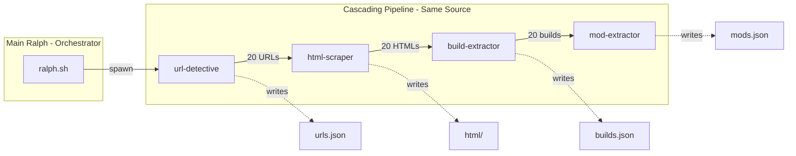
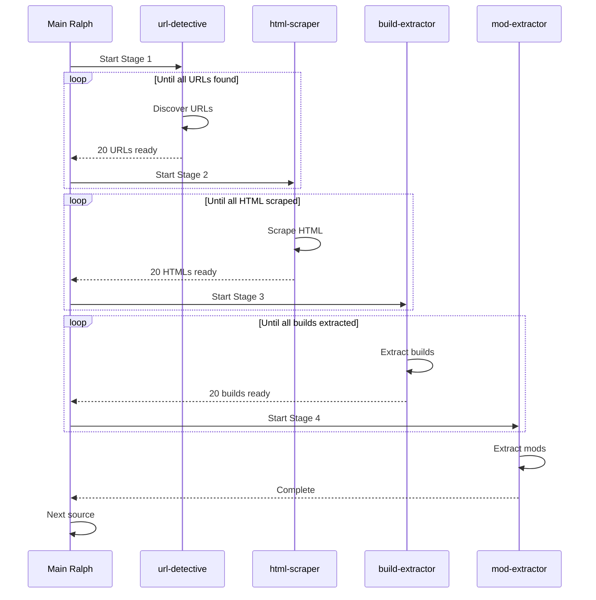

# Sub-Ralph Pipeline Architecture

## Architecture Overview




## Execution Flow




## Files to Create

### 1. Sub-Ralph Prompt Files

| File | Purpose ||------|---------|| [`scripts/ralph/prompts/url_detective.md`](scripts/ralph/prompts/url_detective.md) | URL discovery specialist || [`scripts/ralph/prompts/html_scraper.md`](scripts/ralph/prompts/html_scraper.md) | HTML scraping specialist || [`scripts/ralph/prompts/build_extractor.md`](scripts/ralph/prompts/build_extractor.md) | Build extraction specialist || [`scripts/ralph/prompts/mod_extractor.md`](scripts/ralph/prompts/mod_extractor.md) | Mod extraction specialist |

### 2. Pipeline Orchestrator

[`scripts/ralph/pipeline.sh`](scripts/ralph/pipeline.sh) - Main orchestration script:

```bash
# Monitors output files and triggers sub-ralphs
# - Watches urls.json count, triggers html-scraper at 20
# - Watches html/ count, triggers build-extractor at 20
# - Watches builds.json count, triggers mod-extractor at 20
# - Waits for all 4 to complete before next source
```


### 3. Progress Monitor

[`scripts/ralph/pipeline_monitor.py`](scripts/ralph/pipeline_monitor.py) - Tracks pipeline state:

```python
# Watches output files and returns trigger signals
def check_triggers(source_id):
    urls_count = count_urls(f"scraped_builds/{source_id}/urls.json")
    html_count = count_files(f"scraped_builds/{source_id}/html/")
    builds_count = count_builds(f"scraped_builds/{source_id}/builds.json")
    
    return {
        "start_html_scraper": urls_count >= 20,
        "start_build_extractor": html_count >= 20,
        "start_mod_extractor": builds_count >= 20
    }
```


## Sub-Ralph Responsibilities

### url-detective

- Focus: URL discovery ONLY
- Input: source URL from sources.json
- Output: `{outputDir}/urls.json`
- Tools: MCP webReader, webSearchPrime
- Stories: URL-001 through URL-004
- Stops when: All URLs discovered, expectedUrls updated

### html-scraper

- Focus: HTML scraping ONLY
- Input: `{outputDir}/urls.json`
- Output: `{outputDir}/html/*.html`
- Stories: HTML-001 through HTML-003
- Stops when: All URLs scraped OR blocked (sets status)

### build-extractor

- Focus: Build extraction ONLY
- Input: `{outputDir}/html/`, `schema/build_extraction_schema.json`
- Output: `{outputDir}/builds.json`
- Tools: `build_id_generator.py`
- Stories: BUILD-001 through BUILD-004
- Stops when: All HTMLs processed

### mod-extractor

- Focus: Mod extraction ONLY
- Input: `{outputDir}/builds.json`, `schema/build_extraction_schema.json`
- Output: `{outputDir}/mods.json`
- Tools: `category_detector.py`
- Stories: MOD-001 through MOD-004
- Stops when: All builds processed

## Trigger Thresholds

| Trigger | Condition | Action ||---------|-----------|--------|| Start html-scraper | `len(urls.json) >= 20` | Spawn html-scraper subprocess || Start build-extractor | `count(html/*.html) >= 20` | Spawn build-extractor subprocess || Start mod-extractor | `len(builds.json) >= 20` | Spawn mod-extractor subprocess || Source complete | All 4 sub-ralphs exit 0 | Move to next source |

## Quality Control (Main Ralph)

After all sub-ralphs complete:

1. Verify counts: `urlsFound == len(urls.json)`
2. Verify counts: `htmlScraped == count(html/)`
3. Validate `builds.json` against schema
4. Validate `mods.json` has categories from `category_detector.py`
5. Update `sources.json` with final pipeline counts
6. Set status: `completed`, `blocked`, or `in_progress`

## Implementation Order

1. Create prompt files for each sub-ralph (focused, minimal)
2. Create `pipeline_monitor.py` for threshold checking